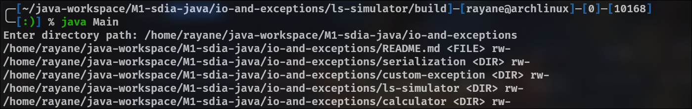
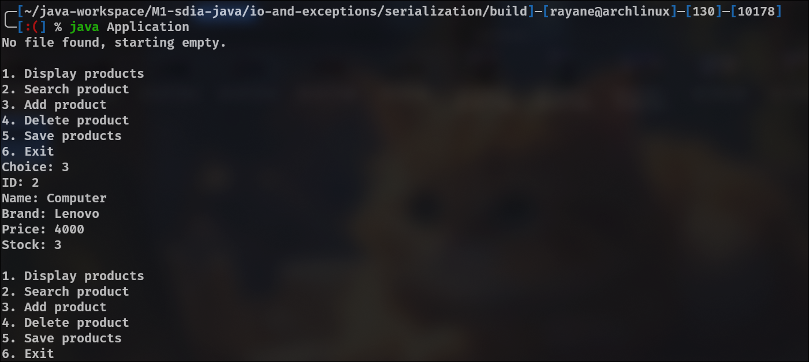
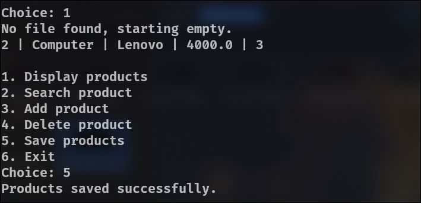
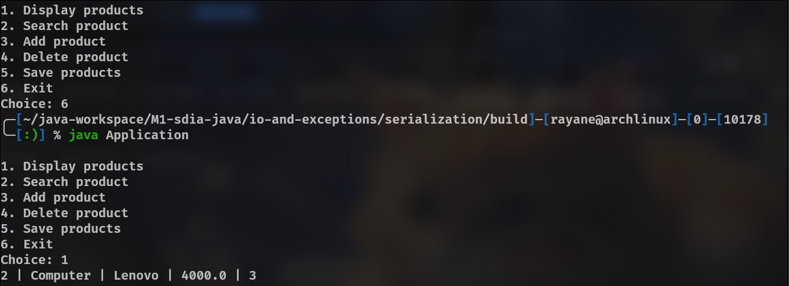
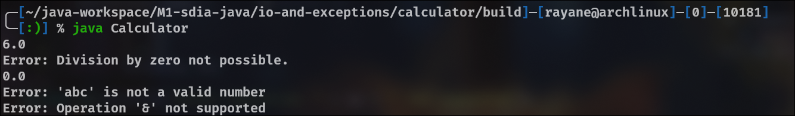

# Java Lab -- Input/Output and Exception Handling

## Project Overview

This laboratory contains several independent Java mini-projects designed
to practice:

- File input/output
- Object serialization
- Exception handling
- Custom exceptions

Each exercise is implemented in separate directory.

------------------------------------------------------------------------

## Exercise 1 --- Simulating the `ls` Command

### Problem

Develop a Java program that simulates the Unix `ls` command:

- The user enters a full directory path.
- The program lists all files and directories inside it.
- For each entry, display:
  - `<DIR>` for directories or `<FILE>` for files
  - Access permissions:
    - `r` if readable
    - `w` if writable
    - `h` if hidden

Example output:

    ..\xampp\htdocs\tp1\index.php <FILE> rw-
    ..\xampp\htdocs\tp1\accueil.htm <FILE> rw-
    ..\xampp\htdocs\tp1\images <DIR> rw-

### Solution

- The `File` class is used to represent directories and files.
- The `listFiles()` method retrieves all entries.
- Permissions are checked using `canRead()`, `canWrite()`, and
  `isHidden()`.

```java
File[] files = dir.listFiles();
for (File f : files) {
    String type = f.isDirectory() ? "<DIR>" : "<FILE>";
    String r = f.canRead() ? "r" : "-";
    String w = f.canWrite() ? "w" : "-";
    String h = f.isHidden() ? "h" : "-";

    System.out.println(f.getAbsolutePath() + " " + type + " " + r + w + h);
}
```



------------------------------------------------------------------------

## Exercise 2 --- Product Serialization (`products.dat`)

### Problem

Create a product management system using object serialization:

- Create a `Product` class implementing `Serializable`.
- Store and load products from a file named `products.dat`.
- Provide a menu with the following options:
  1. Display products\
  2. Search by ID\
  3. Add product\
  4. Delete product\
  5. Save products\
  6. Exit

### Solution

- Products are stored in an `ArrayList<Product>`.
- Data is saved and loaded using `ObjectOutputStream` and
  `ObjectInputStream`.

Saving the list:

```java
ObjectOutputStream oos = new ObjectOutputStream(new FileOutputStream("products.dat"));
oos.writeObject(products);
```

Loading the list:

```java
ObjectInputStream ois = new ObjectInputStream(new FileInputStream("products.dat"));
products = (List<Product>) ois.readObject();
```

- The menu is implemented with a `do...while` loop and a `switch`
  statement.





------------------------------------------------------------------------

## Exercise 3 --- Calculator with Exception Handling

### Problem

Create a `Calculator` class with methods:

- `divide(a, b)`
  - Displays an error if `b == 0`
- `convertToNumber(text)`
  - Displays an error if the string is not numeric
- `calculate(op, a, b)`
  - Supports `+`, `-`, `*`, `/`\
  - Displays an error for unsupported operations

### Solution

- Standard exceptions (`NumberFormatException`) are handled using
  `try...catch`.
- Error messages are displayed instead of stopping the program.

Example:

```java
public int convertToNumber(String text) {
    try {
        return Integer.parseInt(text);
    } catch (NumberFormatException e) {
        System.out.println("Error: '" + text + "' is not a valid number");
        return 0;
    }
}
```



------------------------------------------------------------------------

## Exercise 4 --- Custom Exception: TooFastException

### Problem

- Create a custom exception `TooFastException`.
- Create a `Vehicle` class with a `testSpeed(int speed)` method:
  - Throws `TooFastException` if speed \> 90.
- In `main`, call the method twice and display the call stack.

### Solution

- The custom exception extends `Exception`.
- The exception is thrown manually using `throw`.

```java
if (speed > 90) {
    throw new TooFastException(speed);
}
```

- The call stack is displayed using:

```java
e.printStackTrace();
```


------------------------------------------------------------------------

## Conclusion

These projects demonstrate:

- File and directory manipulation
- Object serialization and persistence
- Robust exception handling
- Custom exception creation
- Console-based application design
