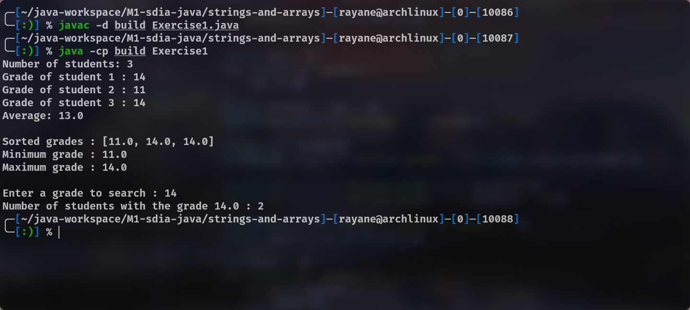
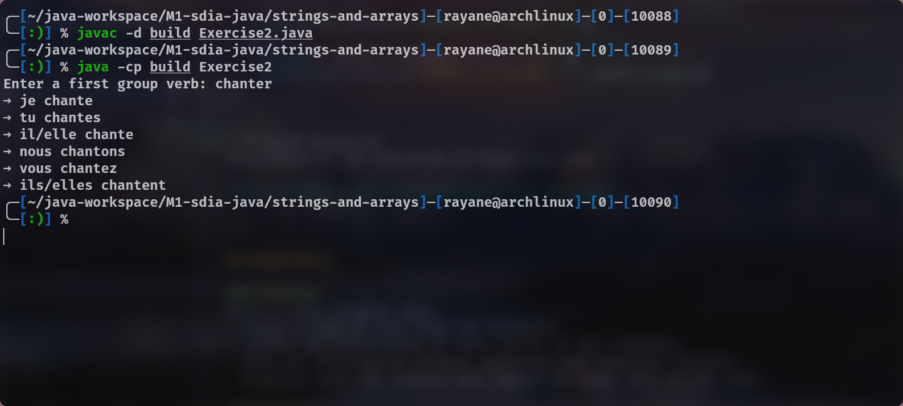
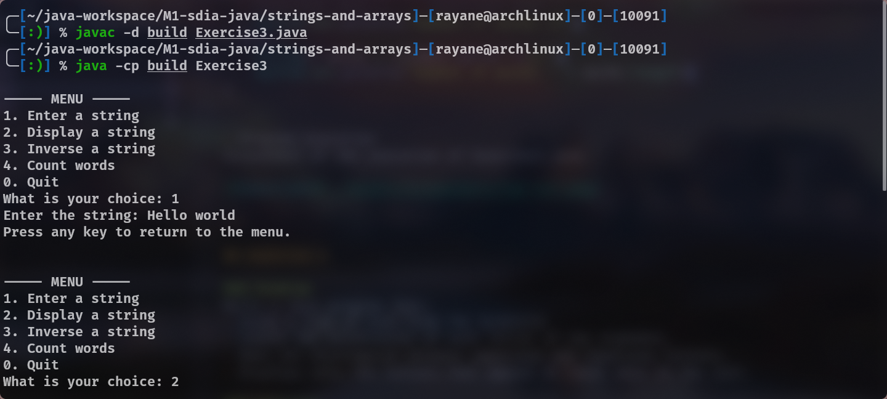
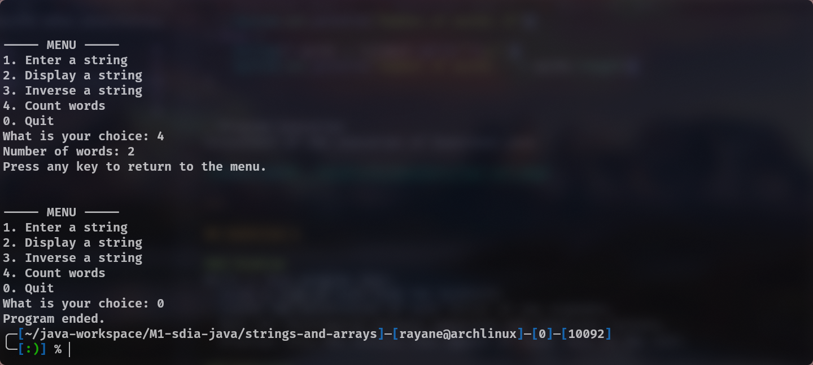
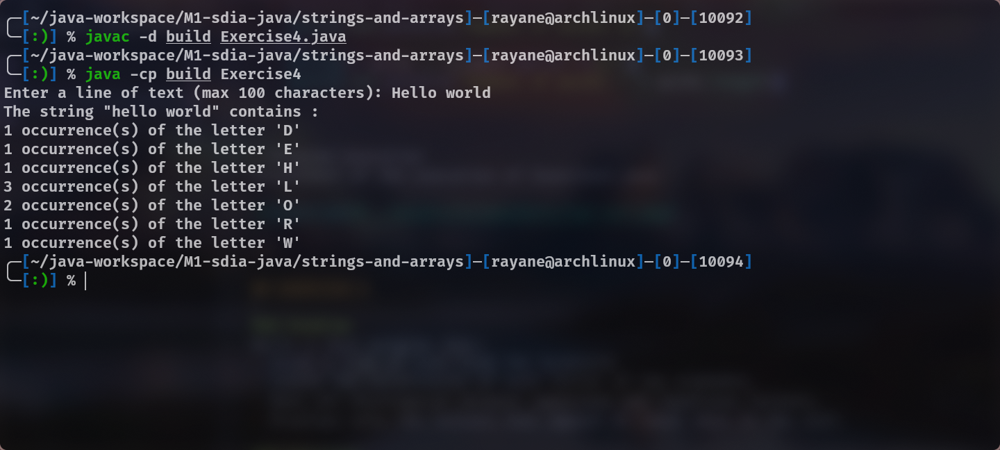

# Java Lab – Strings, Arrays and OOP

## Exercise 1

### Problem

A Java program that:

- reads students’ grades from the keyboard,
- stores them in an array called `grades`,
- performs the following operations:
  1. Sort and display the grades,
  2. Calculate the average grade,
  3. Display the highest and lowest grades,
  4. Count the number of students who obtained a given grade.

### Solution

- A `double[]` array is used to store the grades.

```java
double[] grades = new double[n];
int n = 0;
System.out.print("Number of students: ");
n = sc.nextInt();

for (int i = 0; i < n; i++) {
    System.out.print("Grade of student " + (i + 1) + ": ");
    grades[i] = sc.nextDouble();
}
```

- A loop is used to calculate the sum and the average.

```java
double sum = 0;
for (double g : grades) {
sum += g;
}
double average = sum / n;
System.out.println("Average: " + average);
```

- The Arrays.sort() method is used to sort the grades, making it possible to determine the minimum and maximum values.
  
```java
Arrays.sort(grades);
System.out.println("\nSorted grades: " + Arrays.toString(grades));

System.out.println("Minimum grade: " + grades[0]);
System.out.println("Maximum grade: " + grades[n - 1]);

```

- To count the number of students who obtained a specific grade, a loop is used to count the number of occurrences of that grade.
```java
System.out.print("\nEnter a grade to search: ");
double search = sc.nextDouble();

int count = 0;
for (double g : grades) {
    if (g == search) {
        count++;
    }
}
```

- Program Execution
Screenshot of the execution of Exercise1.java


---

## Exercise 2

### Problem

A Java program that:

- reads a first group French verb from the keyboard,
- checks that the verb ends with **"er"**,
- assumes that the verb is regular,
- displays its conjugation in the present tense.

### Solution

- The verb is read as a `String`.

- The method `endsWith("er")` is used to verify that the verb belongs to the first group.

- The verb stem is obtained using `substring()`.

- The stem is concatenated with the present tense endings.
```java
System.out.print("Enter a first group verb: ");
String verb = sc.nextLine().toLowerCase();

if (!verb.endsWith("er")) {
    System.out.println("This is not a first group verb.");
    return;
}
String stem = verb.substring(0, verb.length() - 2);

```

- The conjugation is displayed using the standard present tense endings.
```java
System.out.println("➔ je " + stem + "e");
System.out.println("➔ tu " + stem + "es");
System.out.println("➔ il/elle " + stem + "e");
System.out.println("➔ nous " + stem + "ons");
System.out.println("➔ vous " + stem + "ez");
System.out.println("➔ ils/elles " + stem + "ent");
```

- Program Execution
Screenshot of the execution of Exercise2.java


---

## Exercise 3

### Problem

A Java program that allows the user to perform several operations on a character string using a menu.  
The program must provide the following options:

1. Enter a string from the keyboard,
2. Display the entered string,
3. Reverse the string,
4. Count the number of words in the string.

### Solution

- A menu is implemented using a `do...while` loop.

- The user's choice is handled using a `switch` statement.

- The string is stored in a variable of type `String`.

- The string reversal is done using `StringBuilder.reverse()`.

- The number of words is calculated by splitting the string using one or more spaces (`\\s+`).

- String reversal:
```java
String reversed = new StringBuilder(text).reverse().toString();
System.out.println("Inversed string: " + reversed);
```

- Word counting (handling multiple spaces):
```java
String trimmed = text.trim();
if (trimmed.isEmpty()) {
  System.out.println("Number of words: 0");
} else {
  String[] words = trimmed.split("\\s+");
  System.out.println("Number of words: " + words.length);
}
```

- Program Execution
Screenshot of the execution of Exercise3.java





---

## Exercise 4

### Problem

Write a Java program that:

- reads a line of text from the keyboard,
- counts the occurrences of each letter of the alphabet,
- does not distinguish between uppercase and lowercase letters,
- displays only the letters that appear at least once in the text.

### Solution

- The input string is converted to lowercase to avoid distinguishing between uppercase and lowercase letters.

- A one-dimensional array of size 26 (`int[26]`) is used to store the occurrences of letters from **A** to **Z**.

- Each character is checked to ensure that it is a letter before counting.

- The index of each letter is calculated using `c - 'a'`.

- Reading the input string and initializing the array:
```java
Scanner sc = new Scanner(System.in);
int[] nb_occurrences = new int[26];

System.out.print("Enter a line of text (max 100 characters): ");
String ch = sc.nextLine().toLowerCase();

```

- Counting the letter occurrences:

```java
for (int i = 0; i < ch.length(); i++) {
    char c = ch.charAt(i);
    if (c >= 'a' && c <= 'z') {
        nb_occurrences[c - 'a']++;
    }
}
```

- Displaying only the letters that appear at least once:  
```java
System.out.println("The string \"" + ch + "\" contains :");
for (int i = 0; i < 26; i++) {
  if (nb_occurrences[i] > 0) {
      char letter = (char) ('A' + i);
      System.out.println(
          nb_occurrences[i] + " occurrence(s) of the letter '" + letter + "'"
      );
  }
}
```

- Program Execution
Screenshot of the execution of Exercise4.java


---
